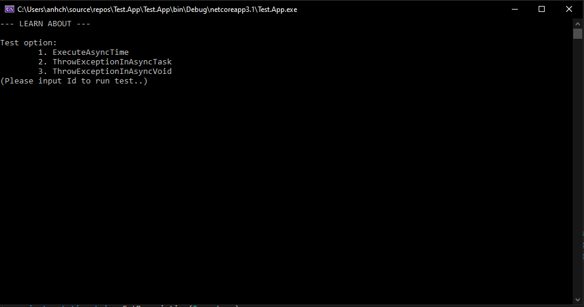

# Trainning
Learning and demo with TestApp
> *Copyright 2020 [ChungNA](https://github.com/chungpj)*

## Project List:
### 1. Async Test
Console Application
- Test Async execute total time (difference between asynchronous and synchronous).
- Difference between Async Void & Async Task.

### 2. Dependency Injection Test
net core 3.1 Web Application
- Difference between AddScoped, AddTransient and AddSingleton

### 3. Async JS
Demo Callback, Promise and Async/Await in javascript